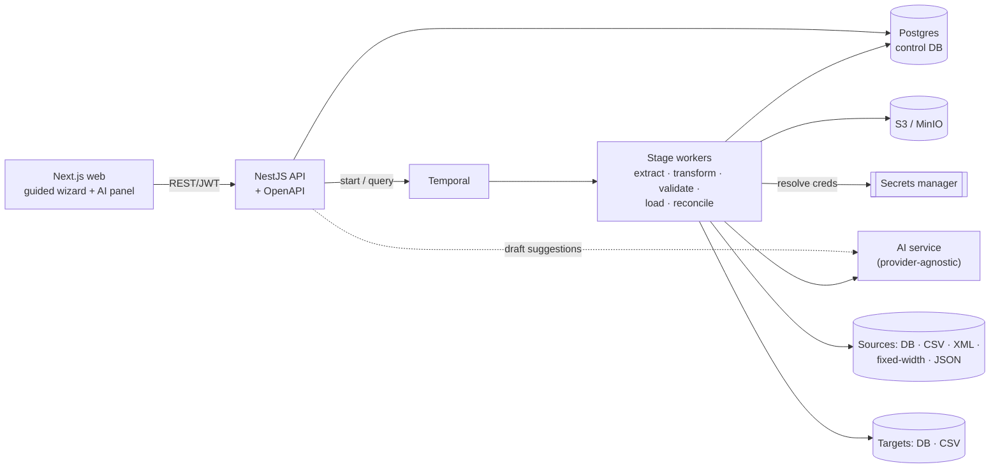

# etl-platform

A **white-label, AI-assisted ETL and data migration platform** for enterprise
software companies. AI does the initial analysis and mapping; humans review,
correct, test and approve **deterministic, versioned, auditable** configuration
before anything runs in production.

> **Status:** Phases 1–6 complete — a working MVP. Architecture + contracts
> (P1), runnable monorepo/apps (P2), schema ingestion (P3), AI source
> understanding + field mapping (P4), transformation/validation builders +
> deterministic test runs with rejects/reconciliation/AI error explanation (P5),
> and migration sequencing + immutable versioning/approval + generated docs (P6)
> are all working and verified end-to-end (API + browser). See [`docs/`](./docs).

## Run it locally

```bash
pnpm install
cp .env.example .env
pnpm docker:up                       # Postgres, Temporal (+UI), MinIO
pnpm db:generate && pnpm db:migrate && pnpm db:seed
pnpm build --filter='./packages/*'   # build shared packages once
pnpm dev                             # web :3000 · api :3001/api/docs · worker
```

Then open the app and sign in with the seeded account:

| Surface | URL | Login |
|---------|-----|-------|
| **Web app** | http://localhost:3000 | `admin@example.com` / `demo1234!` (tenant `demo`) |
| **API / OpenAPI** | http://localhost:3001/api/docs | Bearer token from `POST /api/auth/login` |
| Temporal UI | http://localhost:8080 | — |
| MinIO console | http://localhost:9001 | `minioadmin` / `minioadmin` |

> **Port note:** the API defaults to **3001**. If that port is taken on your
> machine, start it elsewhere and point the web app at it:
> `API_PORT=3077 pnpm --filter @etl/api dev` and
> `NEXT_PUBLIC_API_URL=http://localhost:3077 pnpm --filter @etl/web dev`.

**A good first walk-through:** Schemas → *Fixed-width — from documentation* (paste
a record layout, it derives the columns) → create a Project → attach a data
dictionary under **Docs & layer** → *Generate transformation layer* → review in
**Mappings** / **Validations** → **Test** with sample rows → **Versions** →
approve + generate the mapping document.

## Architecture at a glance



**Core principle:** the AI proposes drafts (mappings, transforms, validations,
docs); humans review, test and approve **deterministic, versioned, auditable**
config before anything runs in production. The LLM is never in the record path.

## What's here

| Area | Where | Status |
|------|-------|--------|
| Architecture, domain model, workflows, AI tools, MVP plan | [`docs/`](./docs) | ✅ complete |
| Canonical schema, connector SDK, mapping/transform/validation configs | `packages/*` | ✅ typed + deterministic core |
| Control DB (Prisma) | `packages/database` | ✅ schema + seed |
| NestJS API + OpenAPI | `apps/api` | ✅ auth, tenants, projects, connections, schemas, mappings |
| Schema ingestion (DB discover · DDL · dictionary · sample · OpenAPI) | `apps/api` `schemas/*` | ✅ canonical storage + profiling + snapshots |
| File formats: CSV · delimited (pipe/tab) · JSON · XML · **fixed-width from documentation** · **HL7 v2** | `packages/connectors` · `schema-discovery` | ✅ layout inferred from tabular/COBOL/position-range specs; HL7 batch → patient + transaction entities |
| Documentation-assisted mapping | `apps/api` `mappings/*` · `schema-discovery/doc` | ✅ attach data dictionary/record layout; AI maps cryptic names & cites the doc |
| One-shot transformation-layer generation | `apps/api` `mappings/generate-layer` | ✅ source + docs + target → mappings + transforms + validations as draft config |
| AI source understanding + field mapping | `apps/api` `schemas/overview` · `mappings/*` | ✅ confidence + evidence + risks; accept/reject/edit → draft config |
| Validation & transformation builders (+ AI suggest) | `apps/api` `versions/*` | ✅ suggest from constraints/risks; accept → draft config |
| Deterministic test runs | `apps/api` `testruns/*` | ✅ map→transform→validate→reconcile; rejects + AI error explanation |
| Migration sequencing | `apps/api` `migration/*` | ✅ FK dependency waves (parents before children) |
| Versioning, approval, generated docs | `apps/api` `versions/*` | ✅ immutable deploy, diff, mapping document from approved config |
| Temporal worker | `apps/worker` | ✅ boots; schema-intake + test-run workflows |
| Next.js white-label web | `apps/web` | ✅ login, dashboard, connections, schema browser, source overview, mapping workspace |
| Connectors (postgres, mysql, csv, json) | `packages/connectors` | ✅ test + discover + read |
| AI layer (Anthropic + heuristic backbone) | `packages/ai-service` | ✅ provider-agnostic, structured output, redaction |

## Prerequisites

- **Node ≥ 20** (see `.nvmrc`)
- **pnpm ≥ 9** (`corepack enable`)
- **Docker** (for Postgres, Temporal, MinIO)

## Quick start

```bash
# 1. Install
pnpm install

# 2. Env
cp .env.example .env            # defaults work with the docker-compose stack

# 3. Local infra: Postgres, Temporal (+UI :8080), MinIO (:9001)
pnpm docker:up

# 4. Control database: generate client, run migrations, seed a demo tenant
pnpm db:generate
pnpm db:migrate                 # creates the schema (first run: names the migration)
pnpm db:seed                    # login: admin@example.com / demo1234!  (tenant: demo)

# 5. Build shared packages once (apps depend on their compiled output)
pnpm build --filter='./packages/*'

# 6. Run the stack (three terminals, or `pnpm dev` to run all via turbo)
pnpm --filter @etl/api dev      # http://localhost:3001  (OpenAPI at /api/docs)
pnpm --filter @etl/worker dev   # connects to Temporal
pnpm --filter @etl/web dev      # http://localhost:3000
```

Then open **http://localhost:3000**, sign in with the seeded account, and you'll
land on the guided setup flow. The API's OpenAPI explorer is at
**http://localhost:3001/api/docs**.

## Monorepo layout

```
apps/      web (Next.js)  ·  api (NestJS)  ·  worker (Temporal)
packages/  shared-types · database · auth · tenancy · secrets · storage ·
           connector-sdk · connectors · schema-model · schema-discovery ·
           profiling · mapping-engine · transformation-engine ·
           validation-engine · workflow-definitions · ai-service · audit ·
           observability
docs/      ARCHITECTURE · DOMAIN-MODEL · WORKFLOWS · AI-TOOLS · MVP
```

See [`docs/ARCHITECTURE.md`](./docs/ARCHITECTURE.md) for the full Phase-1 design
(diagram, decisions, risks) and the other docs for details.

## Core principles baked into the code

- **AI proposes, humans approve.** The AI layer (`packages/ai-service`) is
  draft-only — it never writes production config or processes production
  records. Deterministic engines do all record processing.
- **Everything is versioned & auditable.** Deployed `ProjectVersion` rows are
  immutable; every job carries the lineage tuple
  (`tenant/customer/environment/project/version/run`); `packages/audit` records
  an append-only trail.
- **Credentials are never in app tables.** Only opaque `secretRef` pointers are
  stored; workers resolve real values via `packages/secrets`.
- **No heavy work in HTTP handlers.** Long-running extraction/transform/load run
  in Temporal workers with streaming/batch + DuckDB.
- **One codebase, many brands.** White-label theme tokens, terminology and
  enabled modules are per-tenant.

## Useful commands

```bash
pnpm typecheck      # type-check everything (turbo)
pnpm build          # build all packages & apps
pnpm test           # run engine unit tests
pnpm db:studio      # Prisma Studio (via --filter @etl/database)
pnpm docker:down    # stop local infra
```

## Environment variables

See [`.env.example`](./.env.example). Notable: `DATABASE_URL` (control DB),
`TEMPORAL_ADDRESS`, `S3_*` (MinIO), `AI_PROVIDER`/`AI_*` (defaults to Anthropic),
`SECRETS_PROVIDER` (`env` locally, `aws` in cloud), `JWT_SECRET`.

## License

Proprietary — all rights reserved (placeholder; set as appropriate).
