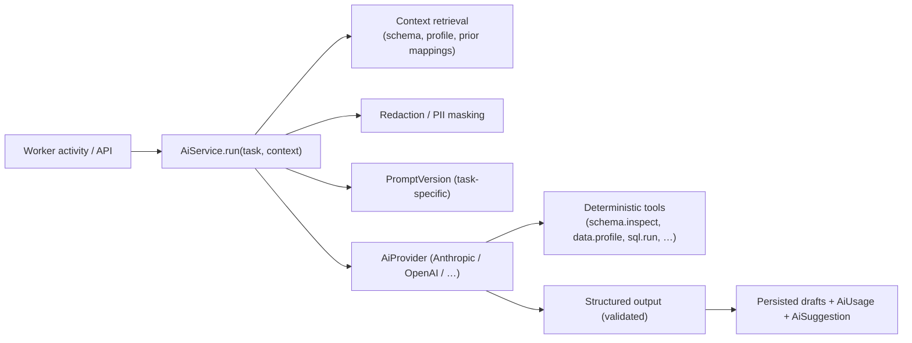

# AI Assistant Tools & Structured Outputs (Deliverable 11)

The AI layer is **provider-agnostic** and **draft-only**: every action produces
reviewable drafts. It never writes production config or processes production
records. TypeScript contracts live in
[`packages/ai-service`](../packages/ai-service).

## Layer responsibilities

- Structured outputs (JSON-schema-constrained), tool calling, prompt versioning.
- Token & cost tracking per tenant / task / model.
- Retrieval of relevant schema context and approved historical mappings.
- Redaction of sensitive values before any model call (tenant-configurable).
- User feedback capture on suggestions; per-tenant AI settings; model-by-task.



## Assistant capabilities (controlled actions)

Each returns **drafts**, surfaced in the UI for accept/reject/edit. The assistant
panel is context-aware (tenant, customer, project, source, destination, schema,
mapping version, test run, error, migration stage).

| Capability | Produces (draft) | Backed by |
|-----------|------------------|-----------|
| Explain a table | `TableInsight` + evidence | deterministic tools + LLM |
| Suggest joins | `RelationshipInsight[]` | FK graph + LLM |
| Generate mappings | `MappingSuggestion[]` | schema + samples + prior mappings + LLM |
| Create a draft transformation | `TransformationDraft` | source/target diff + LLM |
| Add draft validation rules | `ValidationSuggestion[]` | target constraints + profile + LLM |
| Summarise test failures | `FailureSummary` | reject data (deterministic) + LLM |
| Explain an error | `ErrorExplanation` | run logs + LLM |
| Recommend migration order | `MigrationOrder` | FK/inferred graph + LLM |
| Generate documentation | `GeneratedDocument` | approved config (deterministic) + LLM prose |

## Deterministic tools (LLM may call; results are ground truth)

The LLM interprets; **these tools do the facts.** Exposed via the provider's
tool-calling interface and implemented in workers.

```
schema.inspect(entityRef)           -> Entity + Field[] (canonical, confirmed)
schema.relationships(schemaId)      -> Relationship[] (declared + inferred w/ confidence)
data.profile(entityRef)             -> ProfileResult (null rates, distinct, formats, PII)
data.sample(entityRef, n, redact)   -> redacted sample rows
sql.run(duckdbQuery)                -> result set (read-only, sandboxed)
data.count(entityRef, filter?)      -> row count
data.reconcile(source, target)      -> counts / financial / referential diff
mappings.findApproved(entityRef)    -> prior approved FieldMapping[] (reuse)
validation.evaluate(rule, sample)   -> pass/warn/fail preview
```

## Structured-output contracts (shape summary)

Full Zod/JSON schemas in `packages/ai-service/src/schemas.ts`. Every AI
conclusion carries **certainty** and **evidence** — guesses are never presented
as facts.

```ts
type Certainty = 'confirmed' | 'strong_inference' | 'weak_assumption' | 'needs_confirmation';

interface Evidence {
  kind: 'table_name' | 'column_name' | 'foreign_key' | 'example_value'
      | 'row_distribution' | 'documentation' | 'uploaded_mapping';
  detail: string;          // e.g. "FK debts.account_id -> accounts.id"
  ref?: string;            // entity/field/relationship id
}

interface TableInsight {
  entityRef: string;
  likelyPurpose: string;
  likelyEntity: string;                    // e.g. "customer account"
  classification: 'transaction' | 'lookup' | 'audit' | 'config'
                | 'archive' | 'core' | 'unknown';
  importantFields: string[];
  certainty: Certainty;
  evidence: Evidence[];
  needsUserConfirmation: boolean;
}

interface MappingSuggestion {
  sourceField: string;                     // e.g. "debtor_first_name"
  targetField: string;                     // e.g. "party.given_name"
  mappingType: 'exact' | 'likely' | 'composite' | 'split' | 'lookup'
             | 'conditional' | 'derived' | 'unmapped';
  confidence: number;                      // 0..1
  reasoning: string;
  evidence: Evidence[];
  requiredTransformation?: TransformationDraft;
  requiredValidation?: ValidationSuggestion[];
  risks: string[];                         // incl. "potentially destructive"
  requiresHumanConfirmation: boolean;
}

interface ValidationSuggestion {
  level: 'file' | 'schema' | 'record' | 'field' | 'cross_field'
       | 'cross_table' | 'batch' | 'destination';
  ruleType: string;                        // e.g. "required", "valid_date", "referential_integrity"
  targetField?: string;
  params: Record<string, unknown>;
  rationale: string;
  certainty: Certainty;
}

interface ErrorExplanation {
  plainEnglish: string;                    // "The SFTP credentials have expired."
  probableCause: 'source' | 'mapping' | 'destination' | 'infrastructure' | 'data_quality';
  suggestedActions: string[];              // recommendations only — never auto-applied
  affectedFields?: string[];
  affectedRecordCount?: number;
}

interface MigrationOrder {
  sequence: { entityRef: string; order: number; reason: string; dependsOn: string[] }[];
  certainty: Certainty;
  evidence: Evidence[];
}
```

## Guardrails

- **Draft-only:** assistant actions create reviewable drafts; approval is a
  separate human step. The AI cannot change deployed config.
- **Evidence-required:** overview/mapping/validation outputs must cite evidence;
  the persistence layer rejects conclusions lacking it for `confirmed`/`strong`.
- **Redaction:** PII is masked/tokenised before model calls per tenant AI
  settings; tenants may disable sample-value sharing entirely.
- **Accountable:** every call logs `AiUsage` (tokens, cost, model, task) and an
  `AiSuggestion`; user decisions log `AiFeedback`.
- **Never in the record path:** deterministic engines process production records;
  the LLM only interprets, suggests, explains and documents.
