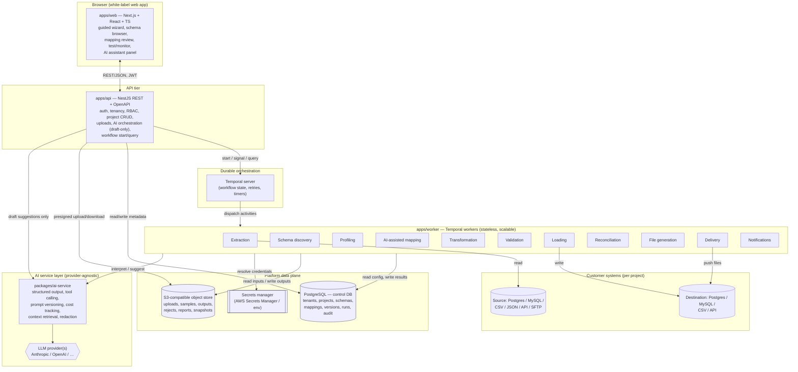

# etl-platform — Architecture (Phase 1)

White-label, AI-assisted ETL & data migration platform for enterprise software
companies.

> **Core principle.** AI does most of the initial analysis and mapping; humans
> review, correct, test and approve **deterministic configuration** before
> anything runs in production. Production execution is predictable, versioned,
> auditable and repeatable. The LLM is never the sole mechanism for processing
> production records.

This document contains the Phase-1 deliverables. Companion documents:

- [`DOMAIN-MODEL.md`](./DOMAIN-MODEL.md) — bounded contexts, entities, data model notes.
- [`WORKFLOWS.md`](./WORKFLOWS.md) — Temporal workflow & activity outline.
- [`AI-TOOLS.md`](./AI-TOOLS.md) — AI assistant tools & structured-output schemas.
- [`MVP.md`](./MVP.md) — screen list, user journey, 12-week plan.
- Canonical TypeScript contracts live in code (deliverables 5–9):
  - Connector SDK → [`packages/connector-sdk`](../packages/connector-sdk)
  - Canonical schema → [`packages/schema-model`](../packages/schema-model)
  - Mapping definition → [`packages/mapping-engine`](../packages/mapping-engine)
  - Transformation definition → [`packages/transformation-engine`](../packages/transformation-engine)
  - Validation definition → [`packages/validation-engine`](../packages/validation-engine)

---

## Assumptions (stated defaults)

These are product/technical decisions made to keep momentum. Each is a
recommended default and can be revisited.

1. **Monorepo tooling:** pnpm workspaces + Turborepo. (Nx is the alternative;
   pnpm+Turbo is lighter and sufficient here.)
2. **Control-DB access:** Prisma for the control database. It gives typed
   access + a first-class migration story fast. DuckDB in workers is used via
   raw SQL, not Prisma.
3. **Web framework:** Next.js (App Router). SSR is useful for auth, white-label
   theming per domain, and doc rendering.
4. **Auth (MVP):** built-in email/password + JWT behind an `AuthProvider`
   interface, so an enterprise SSO/OIDC provider can drop in later.
5. **AI default provider:** Anthropic (`claude-*`) behind a provider-agnostic
   `AiProvider` interface. Model is selectable per task and per tenant.
6. **Tenancy isolation (MVP):** shared database, shared schema, `tenant_id` on
   every row + enforced query scoping. Postgres Row-Level Security is enabled as
   defence-in-depth. Schema-per-tenant / DB-per-tenant is a later option for
   customers that require it.
7. **Secrets:** an `env`-backed store for local dev; AWS Secrets Manager adapter
   for real environments. Source/destination credentials are **never** in
   control tables — only opaque secret references are stored.
8. **Object storage:** S3-compatible (MinIO locally, S3 in cloud).
9. **Execution engine:** Temporal for durable, resumable workflows; DuckDB for
   in-worker file/SQL processing; streaming/batch to avoid loading whole files
   into memory.
10. **Record-processing model (MVP):** row-batch pipeline. Streaming/CDC is
    explicitly out of MVP scope.

---

## 1. High-level architecture



**Key flows**

- **Reads/writes of customer data happen only inside workers**, never in HTTP
  handlers. The API starts/queries workflows and serves metadata.
- **AI runs produce drafts** (suggestions, explanations, docs). Nothing the AI
  emits touches production execution until a human approves a version.
- **Every job carries the full lineage tuple:** `tenant_id`, `customer_id`,
  `environment_id`, `project_id`, `project_version_id`, `run_id`.

---

## 2. Monorepo structure

```
etl-platform/
├─ apps/
│  ├─ web/                     # Next.js white-label front end
│  ├─ api/                     # NestJS REST API + OpenAPI
│  └─ worker/                  # Temporal worker host (activities + workflows)
├─ packages/
│  ├─ shared-types/            # Cross-cutting DTOs, enums, lineage tuple, IDs
│  ├─ database/                # Prisma schema, client, migrations, seed
│  ├─ auth/                    # AuthProvider abstraction + local JWT provider
│  ├─ tenancy/                 # Tenant resolution, RLS helpers, scoping guards
│  ├─ connector-sdk/           # Connector interface + capability model (Deliverable 5)
│  ├─ connectors/              # Concrete connectors (postgres, mysql, csv, json)
│  ├─ schema-model/            # Canonical schema representation (Deliverable 6)
│  ├─ schema-discovery/        # DB introspection + file/DDL/dictionary parsers
│  ├─ profiling/              # DuckDB-based data profiling
│  ├─ mapping-engine/          # Mapping config format + deterministic applier (Deliverable 7)
│  ├─ transformation-engine/   # Transformation config + executor (Deliverable 8)
│  ├─ validation-engine/       # Validation config + evaluator (Deliverable 9)
│  ├─ workflow-definitions/    # Temporal workflow/activity type contracts (Deliverable 10)
│  ├─ ai-service/              # Provider-agnostic AI layer + tools (Deliverable 11)
│  ├─ audit/                   # Audit event model + writer
│  ├─ secrets/                 # Secrets abstraction (env + AWS Secrets Manager)
│  ├─ storage/                 # S3-compatible object-store client
│  └─ observability/           # Logging, tracing, metrics helpers
├─ docs/                       # This folder (Phase-1 deliverables)
├─ docker-compose.yml          # postgres, temporal(+ui), minio
├─ turbo.json  pnpm-workspace.yaml  tsconfig.base.json  .env.example
```

Dependency direction (leaf → app): `shared-types` and `schema-model` are the
lowest layer; engines depend on them; `workflow-definitions` depends on engines;
`apps/*` depend on everything they orchestrate. No package imports an app.

---

## 3–9. Domain, data model & contracts

- **Domain model & bounded contexts (3):** see [`DOMAIN-MODEL.md`](./DOMAIN-MODEL.md).
- **PostgreSQL data model (4):** authoritative source is the Prisma schema at
  [`packages/database/prisma/schema.prisma`](../packages/database/prisma/schema.prisma);
  narrative in [`DOMAIN-MODEL.md`](./DOMAIN-MODEL.md).
- **Connector SDK (5):** [`packages/connector-sdk/src/index.ts`](../packages/connector-sdk/src/index.ts).
- **Canonical schema (6):** [`packages/schema-model/src/index.ts`](../packages/schema-model/src/index.ts).
- **Mapping definition (7):** [`packages/mapping-engine/src/types.ts`](../packages/mapping-engine/src/types.ts).
- **Transformation definition (8):** [`packages/transformation-engine/src/types.ts`](../packages/transformation-engine/src/types.ts).
- **Validation definition (9):** [`packages/validation-engine/src/types.ts`](../packages/validation-engine/src/types.ts).

---

## 10–14

- **Temporal workflow outline (10):** [`WORKFLOWS.md`](./WORKFLOWS.md).
- **AI tools & structured outputs (11):** [`AI-TOOLS.md`](./AI-TOOLS.md).
- **MVP screens (12), user journey (13), 12-week plan (14):** [`MVP.md`](./MVP.md).

---

## 15. Key architectural decisions & trade-offs

| # | Decision | Why | Trade-off / alternative |
|---|----------|-----|-------------------------|
| D1 | **Temporal for orchestration** | Durable, resumable, retryable long-running ETL; survives worker restarts; first-class signals/queries for human-in-the-loop approval gates. | Operational weight (extra services). Alt: BullMQ/queue — simpler but no durable multi-step state or built-in retries/compensation. |
| D2 | **DuckDB inside workers** | Fast, embeddable, columnar SQL over CSV/JSON/Parquet without a warehouse; ideal for profiling, joins, dedup, reconciliation. | Not a distributed engine; single-node memory bounds. Mitigate with streaming/partitioned batches. Alt: Spark — overkill for MVP. |
| D3 | **AI proposes, humans approve** | Deterministic, auditable production; LLM output is advisory config, never live data processing. | Slower than "AI just runs it". This is the product's core safety promise, not a limitation. |
| D4 | **Canonical schema model** | One internal representation for DB introspection, DDL, dictionaries, sample inference, OpenAPI → decouples connectors from mapping. | Upfront modelling cost; lossy for exotic types (carried as `nativeType` + `annotations`). |
| D5 | **Prisma for control DB only** | Fast typed CRUD + migrations for platform metadata. | Not used for customer data (that's connectors/DuckDB). Two data-access idioms in the codebase — intentional separation. |
| D6 | **Shared-DB multi-tenancy + RLS** | Fastest path; strong isolation via mandatory `tenant_id` scoping + Postgres RLS. | Weaker than DB-per-tenant. Architecture leaves room to graduate specific tenants to isolated schemas/DBs. |
| D7 | **Secrets never in app tables** | Only opaque `secretRef` stored; values resolved at execution by workers via the secrets abstraction. | Extra indirection; requires secrets infra even in dev (env-backed shim provided). |
| D8 | **Immutable approved versions** | Deployed config is frozen; changes fork a new draft; enables clean diffs, rollback, reproducible runs. | Version proliferation; needs good diff/compare UX. |
| D9 | **Provider-agnostic AI layer** | Avoids lock-in; per-task/per-tenant model selection; prompt versioning + cost tracking centralised. | Lowest-common-denominator feature set across providers; adapter maintenance. |
| D10 | **Next.js SSR** | Per-domain white-label theming, auth, server actions for uploads, doc rendering. | More infra than a static SPA; acceptable for an enterprise app. |
| D11 | **REST + OpenAPI first** | Broad tooling, simple client generation, easy to secure/audit. | Chattier than GraphQL for the mapping UI; revisit if the mapping screen needs it. |
| D12 | **Worker split by stage** | Independent scaling, isolation, and a clean seam for a future customer-hosted execution agent (outbound-only). | More deployables; mitigated by a single worker host image with per-queue config in MVP. |

---

## 16. Main risks & mitigations

| Risk | Impact | Mitigation |
|------|--------|-----------|
| **AI mapping is wrong but plausible** | Bad data migrated to production | Confidence + evidence on every suggestion; human review gate; deterministic apply; test runs + reconciliation before approval; AI never writes production config. |
| **Large files exhaust memory** | Worker OOM, failed runs | Stream/batch everything; DuckDB out-of-core SQL; never buffer whole files in HTTP handlers; enforce per-run size limits/quotas. |
| **Credential leakage** | Breach of customer systems | Secrets abstraction; only `secretRef` in DB; resolve at execution; redaction in AI context; no secrets in logs; encryption at rest/in transit. |
| **PII sent to LLM** | Compliance/privacy breach | PII classification during profiling; redaction/tokenisation before AI calls; tenant-level AI settings incl. opt-out; send schema/metadata, sample values only when permitted. |
| **Cross-tenant data bleed** | Severe breach | `tenant_id` on every row; scoping guards; Postgres RLS; lineage tuple on every job; tests asserting isolation. |
| **Non-deterministic/irreproducible runs** | Broken audit/reconciliation | Immutable versions; schema snapshots; pinned config per run; full lineage; deterministic engines (no LLM in the record path). |
| **Temporal/DuckDB operational learning curve** | Delivery risk | Thin wrappers in `workflow-definitions`/`profiling`; docker-compose local stack; keep MVP workflow set small. |
| **Schema drift in production sources** | Silent data corruption | Schema snapshot vs. live compare at run start; fail-closed on incompatible drift; plain-English AI explanation; require re-approval. |
| **Destructive mappings (truncate/overwrite)** | Data loss at destination | Flag "potentially destructive" mappings; require explicit human confirmation; dry-run + reconciliation; idempotent loads with keys. |
| **Scope creep beyond MVP** | Missed delivery | Hard MVP boundary (see `MVP.md`); connectors/AI features behind capability flags & tenant module toggles. |
| **Cost blow-out on AI** | Margin erosion | Token/cost tracking per tenant/task; model selection by task; caching of schema context; per-tenant quotas. |
| **White-label leakage (wrong brand/domain)** | Trust damage | Tenant resolved from domain; theme tokens + terminology per tenant; no hard-coded brand; snapshot tests per theme. |
