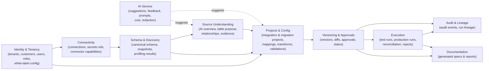

# Domain Model & Bounded Contexts

## 3. Bounded contexts

The platform is organised into bounded contexts. Each owns its entities and
exposes a narrow surface to the others. In the MVP they are modules inside the
API/worker rather than separate services, but the boundaries are respected so
they can be split later.

| Context | Responsibility | Key entities |
|---------|----------------|--------------|
| **Identity & Tenancy** | Who logs in, which brand/customer, what they may do | Tenant, WhiteLabelConfig, Customer, User, Role, Membership |
| **Connectivity** | Definitions of source/destination systems; capability advertising; credential references | Connection, ConnectorCapabilities, SecretRef |
| **Schema & Discovery** | Canonical schema from any intake method; immutable snapshots; profiling | SchemaModel, Entity, Field, Relationship, SchemaSnapshot, ProfileResult |
| **Source Understanding** | AI-assisted, evidence-backed source overview & Q&A | SourceOverview, TableInsight, RelationshipInsight, Evidence |
| **Projects & Config** | Reusable integration/migration projects and their deterministic config | Project, MigrationPlan, MigrationEntity, FieldMapping, Transformation, ValidationRule |
| **Versioning & Approvals** | Immutable versioned config, diffs, approval workflow, lifecycle status | ProjectVersion, VersionDiff, Approval |
| **Execution** | Test & production runs, stage progress, reconciliation, rejects | Run, RunStage, RunMetric, Reconciliation, RejectedRecord |
| **AI Service** | Suggestions, evidence, feedback loop, prompt/version/cost accounting | AiSuggestion, AiFeedback, PromptVersion, AiUsage |
| **Audit & Lineage** | Immutable audit trail; end-to-end source-to-target traceability | AuditEvent, RunLineage |
| **Documentation** | Generated artefacts derived from approved config | GeneratedDocument |

---

## 4. PostgreSQL data model (narrative)

The authoritative definition is the Prisma schema:
[`packages/database/prisma/schema.prisma`](../packages/database/prisma/schema.prisma).
This section explains intent and the cross-cutting rules.

### Cross-cutting columns

Every tenant-scoped table carries `tenant_id` (indexed, RLS-enforced). Config
and execution tables additionally carry as much of the lineage tuple as applies:
`customer_id`, `environment_id`, `project_id`, `project_version_id`, `run_id`.
All tables have `id` (uuid), `created_at`, `updated_at`; mutable domain tables
also carry `created_by` / `updated_by`.

### Entity groups

**Tenancy & identity**
- `Tenant` — the white-label owner. Has `WhiteLabelConfig` (logo, product name,
  domain, email branding, support details, terminology overrides, enabled
  connectors, enabled modules, theme tokens).
- `Customer` — an end customer of a tenant (the enterprise being onboarded).
- `User`, `Role`, `Membership` — RBAC. A user belongs to a tenant and holds
  roles scoped to tenant and optionally to a customer/project.
- `Environment` — e.g. `development`, `staging`, `production` per tenant;
  execution and promotion are environment-aware.

**Connectivity**
- `Connection` — a source or destination definition: `kind` (source/dest),
  `connectorType` (postgres/mysql/csv/json/rest/sftp/s3…), non-secret config
  (host, port, database, options), a `secretRef` (opaque pointer to the secrets
  store — **no raw credentials**), and advertised `capabilities` (JSON matching
  the connector SDK capability model).

**Schema & discovery**
- `SchemaModel` — a canonical schema for a connection or upload, with
  `intakeMethod` (db-introspection / ddl-upload / dictionary / sample-inference /
  manual / openapi). Contains `Entity` → `Field` and `Relationship` rows.
- `Entity` — table/view/file/endpoint. `Field` — column/property with canonical
  `dataType`, `nativeType`, nullability, keys, and `annotations` (PII flags,
  detected formats, inferred meaning).
- `Relationship` — declared or inferred FK/association with a `confidence` and
  `evidence`.
- `SchemaSnapshot` — an **immutable** point-in-time capture referenced by a
  `ProjectVersion` and by every run for drift detection.
- `ProfileResult` — profiling output per entity/field (null rates, distinct
  counts, min/max, detected formats, duplicates, PII classification).

**Source understanding (AI, advisory)**
- `SourceOverview`, `TableInsight`, `RelationshipInsight` — AI conclusions, each
  with a `certainty` (`confirmed` | `strong_inference` | `weak_assumption` |
  `needs_confirmation`) and linked `Evidence` rows (table names, column names,
  FK refs, example values, row distributions, doc references). Nothing here is
  executable config.

**Projects & configuration**
- `Project` — reusable unit. Fields: tenant, customer, product, `type`
  (`integration` | `migration`), `integrationType`/`direction`, source & dest
  connection refs, source & target schema refs, schedule/trigger, notifications,
  `currentVersionId`.
- `MigrationPlan` + `MigrationEntity` — migration-specific: scope, entity
  sequencing/waves, dependency graph, historical-vs-active decisions,
  extraction strategy per entity.
- `FieldMapping` — deterministic source→target mapping (see mapping-engine
  types). Belongs to a `ProjectVersion` once approved; drafts belong to the
  working set.
- `Transformation` — declarative transform config (transformation-engine types).
- `ValidationRule` — declarative validation config (validation-engine types).

**Versioning & approvals**
- `ProjectVersion` — an **immutable** snapshot once deployed: source/dest config,
  `SchemaSnapshot` refs, mappings, transforms, validations, workflow settings,
  error-handling rules, schedule, docs, test evidence. `status` ∈
  {draft, analysing, mapping, testing, awaiting_approval, approved, deployed,
  paused, retired}. Editing a deployed version forks a new draft.
- `Approval` — who approved which version, when, with notes; gate configurable
  per tenant.
- `VersionDiff` — computed diff between two versions (persisted for audit).

**Execution**
- `Run` — a test or production execution of a specific `ProjectVersion`. Carries
  the full lineage tuple and a `mode` (`test` | `trial` | `delta` | `final` |
  `production`). Rolls up metrics: source/accepted/rejected/created/updated/
  skipped/duplicate counts, API calls, files, warnings, errors, retries,
  current stage.
- `RunStage` — per-stage status/timing (extraction … reconciliation).
- `Reconciliation` — source-to-target counts, financial totals, referential and
  orphan/duplicate checks, field-level comparisons, exceptions.
- `RejectedRecord` — a rejected row with reason, failing rule, and a pointer to
  the reject file in object storage.

**AI accounting**
- `AiSuggestion` — every AI proposal (mapping/transform/validation/explanation)
  with confidence, reasoning, evidence, and a `status` (proposed/accepted/
  rejected/modified).
- `AiFeedback` — user's accept/reject/edit signal, feeding future prompting.
- `PromptVersion` — versioned prompt templates by task.
- `AiUsage` — tokens & cost per call, attributed to tenant/task/model.

**Audit & documentation**
- `AuditEvent` — immutable, append-only: actor, action, subject, before/after,
  lineage tuple, timestamp.
- `GeneratedDocument` — spec/report artefacts, versioned, derived from approved
  config, stored in object storage with a metadata row.

### Referential & integrity rules

- Object storage holds bytes (uploads, samples, outputs, rejects, reports,
  snapshots); the DB holds pointers + checksums, never large payloads.
- Deployed `ProjectVersion`, `SchemaSnapshot`, and `AuditEvent` rows are
  write-once (enforced in the service layer; RLS + revoked UPDATE/DELETE grants
  as defence-in-depth).
- Deleting a `Project` soft-deletes (retains audit + versions for compliance).
