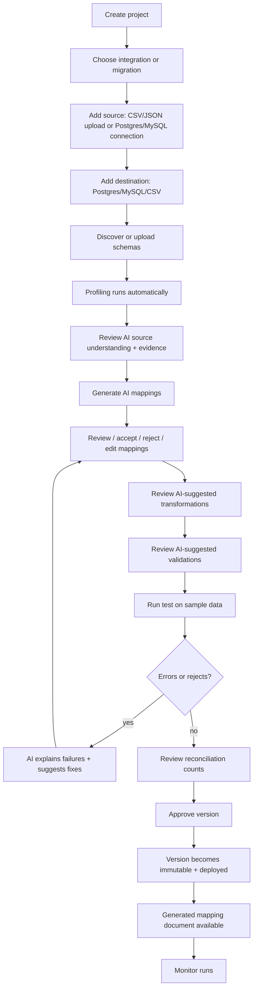

# MVP: Screens, User Journey, 12-Week Plan

## 12. MVP screen list

Guided, wizard-first. No blank technical canvas — every screen has an AI
assistant panel that is aware of the current context.

**Auth & tenancy**
1. **Login / SSO** — white-label branded per domain.
2. **Tenant/customer switcher** — for consultants working across customers.

**Home**
3. **Dashboard** — projects, recent runs, items awaiting approval, alerts.

**Connections**
4. **Connections list** — sources & destinations with capability badges.
5. **New connection wizard** — pick connector → enter non-secret config → store
   credential via secrets abstraction → **Test connection**.

**Schema intake**
6. **Schema intake chooser** — DB discovery / DDL upload / data-dictionary
   upload / sample file / manual / OpenAPI.
7. **Discovery progress** — live workflow status (tables, columns, keys, rows).
8. **Schema browser** — entities → fields, keys, relationships, profiling stats,
   PII flags; AI "Explain this table".

**Source understanding**
9. **AI source overview** — table purposes, relationships, suggested joins, each
   tagged with certainty + evidence; Q&A box ("Which table has customer accounts?").

**Projects**
10. **Projects list**.
11. **New project wizard** — integration vs migration; source; destination;
    schemas; direction; schedule.
12. **Project overview** — status, current version, quick actions.

**Mapping**
13. **Mapping workspace** — source ↔ target with AI suggestions, confidence,
    reasoning, evidence, risks; accept / reject / edit; unmapped & missing-required
    panels.

**Transformation & validation**
14. **Transformation builder** — visual, plain-English per transform, AI suggestions.
15. **Validation builder** — rules by level; AI-suggested rules from constraints/profile.

**Testing**
16. **Test run** — configure sample size, run, live progress.
17. **Test results** — counts by result; source→transformed→target-ready; field
    before/after; rejects; AI failure summary & "why did these fail?".

**Migration**
18. **Migration plan** — entity scope, AI-suggested sequence/waves, dependencies.
19. **Reconciliation** — source/target counts, financial & referential checks,
    orphans/dupes, exceptions.

**Versioning & approval**
20. **Versions & diff** — compare versions; lifecycle status.
21. **Approval** — review test evidence + diff; approve/deploy (per tenant gate).

**Monitoring & docs**
22. **Runs monitor** — run metrics, stages, retries; AI plain-English error explain.
23. **Generated documents** — mapping doc, spec, reconciliation report (download).

**Admin (white-label)**
24. **Tenant settings** — branding, theme tokens, terminology, enabled
    connectors/modules, AI settings.
25. **Users & roles** — RBAC management.

## 13. MVP user journey

The canonical happy path (matches the guided setup flow):

Narrative: *A user uploads a source CSV or connects a Postgres/MySQL source,
provides a target schema, receives AI-generated mapping suggestions, reviews
transformations and validations, runs a test migration, sees errors and
reconciliation results, and saves an approved version.*

## 14. Twelve-week development plan

Two-week increments; each ends with something demoable. Maps to the spec's
Phases 2–6.

| Weeks | Milestone | Delivers |
|-------|-----------|----------|
| **1–2** | **Foundation** (Phase 2) | Monorepo, docker-compose (pg/temporal/minio), Prisma control schema + migrations, shared types, auth (local JWT) + tenancy resolution + RBAC, logging, `.env`, README, CI. Web shell + NestJS app + Swagger + worker host boot. Demo: log in, see empty dashboard, OpenAPI docs. |
| **3–4** | **Connections & DB schema intake** (Phase 3a) | Connector SDK; Postgres & MySQL connectors (test + discover); connection wizard; secrets abstraction (env); schema-discovery workflow; canonical schema storage + snapshot; schema browser. Demo: connect a DB, discover & browse its schema. |
| **5–6** | **File intake & profiling** (Phase 3b) | CSV/JSON connectors; sample-file & DDL & CSV/Excel data-dictionary upload → canonical schema; DuckDB profiling (null rates, types, dupes, PII); object storage (MinIO). Demo: upload a CSV, get inferred schema + profile. |
| **7–8** | **AI understanding & mapping** (Phase 4) | Provider-agnostic AI service (Anthropic), prompt versioning, cost tracking, redaction; source overview with evidence; mapping suggestions with confidence/evidence/risks; mapping workspace with accept/reject/edit; AI feedback storage. Demo: AI maps source→target, human reviews. |
| **9–10** | **Transform, validate, test** (Phase 5) | Transformation engine + visual builder; validation engine + builder; deterministic test-run workflow (extract→transform→validate→load-sandbox); test results UI (counts, before/after, rejects); AI error explanation. Demo: run a test migration end-to-end, see rejects explained. |
| **11–12** | **Migration, reconciliation, versioning & approval** (Phase 6) | Migration project + AI entity sequencing + waves; reconciliation (counts/financial/referential/orphan/dupe); immutable versioning + diff; approval gate + audit history; generated mapping document. Demo: full journey — connect → map → test → reconcile → approve → download mapping doc. |

**Cross-cutting throughout:** audit logging, lineage tuple on every job,
white-label theming, OpenAPI kept current, tests on engines (deterministic core
is the highest-value test surface).

**Explicitly out of MVP:** billing, connector marketplace, Kubernetes, real-time
streaming, SOAP/Oracle/Snowflake/BigQuery, complex CDC, customer-hosted agent,
fully autonomous production deploy, arbitrary customer code, hundreds of
transformation types.
