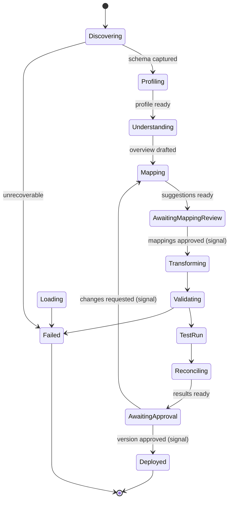

# Temporal Workflow Outline (Deliverable 10)

Orchestration is durable and resumable. Workflows are deterministic and contain
no I/O; all I/O happens in **activities** run by stage-specific workers. Human
approval is modelled with **signals** and progress is exposed via **queries**.

TypeScript contracts live in
[`packages/workflow-definitions`](../packages/workflow-definitions). The worker
host is [`apps/worker`](../apps/worker).

## Task queues (one worker pool per stage)

`extraction`, `schema-discovery`, `profiling`, `ai-mapping`, `transformation`,
`validation`, `loading`, `reconciliation`, `file-generation`, `delivery`,
`notifications`. A single `etl-main` queue is used in dev; production splits
pools so stages scale and isolate independently (and leaves a seam for a future
customer-hosted agent that pulls only its permitted queues over outbound-only
connections).

## Workflow state machine



## Core workflows

### 1. `schemaIntakeWorkflow(input: SchemaIntakeInput)`
Discovers/parses a schema and profiles it. Idempotent; resumable per activity.

```
activities:
  testConnection          (extraction queue)
  discoverSchema          (schema-discovery)     -> canonical SchemaModel
  parseSchemaFile         (schema-discovery)     // DDL / dictionary / OpenAPI / JSON schema
  inferSchemaFromSample   (schema-discovery)     // header/delimiter/type inference
  snapshotSchema          (schema-discovery)     -> immutable SchemaSnapshot in S3 + DB
  profileData             (profiling, DuckDB)    -> ProfileResult (null rates, PII, dupes)
signals: cancel
queries: getStatus -> { stage, entitiesFound, fieldsFound, pctComplete }
```

### 2. `sourceUnderstandingWorkflow(input)`
Generates the evidence-backed AI overview (advisory only).

```
activities:
  gatherSchemaContext     (ai-mapping)   // deterministic: pull schema + profile + prior mappings
  redactSensitive         (ai-mapping)   // strip/tokenise PII per tenant AI settings
  generateSourceOverview  (ai-mapping)   // LLM structured output: table purposes, relationships, evidence
  persistSuggestions      (ai-mapping)   -> SourceOverview + Evidence rows (drafts)
```

### 3. `mappingWorkflow(input)`
Proposes source→target mappings, then waits for human review.

```
activities:
  loadCanonicalSchemas    (ai-mapping)
  retrieveApprovedMappings(ai-mapping)   // reuse of previously approved mappings/business rules
  proposeFieldMappings    (ai-mapping)   // LLM structured output: mapping + confidence + evidence + risks
  persistMappingDrafts    (ai-mapping)
signal: submitMappingReview({ accepted[], rejected[], edited[] })  // human decisions
query: getMappingProgress
-> on signal: convert approved suggestions into deterministic FieldMapping config
```

### 4. `testRunWorkflow(input: { projectVersionId, sampleLimit })`
The heart of the "try before approve" loop. Fully deterministic execution.

```
activities:
  extractSample          (extraction)          // streamed/batched; respects sampleLimit
  applyTransformations   (transformation)       // transformation-engine, DuckDB where useful
  runValidations         (validation)           // validation-engine -> pass/warn/reject
  loadToTargetSandbox    (loading)              // dry-run / sandbox schema
  reconcile              (reconciliation)        // counts, financial, referential, orphan, dup
  writeRejects           (file-generation)       // reject file -> S3
  explainFailures        (ai-mapping, advisory)  // plain-English error explanation (draft)
query: getRunProgress -> RunMetric rollup + current stage
```

### 5. `migrationWorkflow(input: { migrationPlanId, wave, mode })`
Orchestrates a migration wave in dependency order.

```
child workflows: one testRunWorkflow-style pipeline per MigrationEntity,
  scheduled in the AI-suggested (human-approved) sequence, e.g.
  Customers -> Accounts -> Parties -> Addresses -> Debts -> Transactions ...
activities:
  sequenceEntities       (ai-mapping proposes; human approves the order)
  extractEntity / transform / validate / load / reconcile  (per entity, as above)
  crossEntityReconcile   (reconciliation)  // referential integrity across the wave
modes: trial | delta | final ; supports rehearsal runs & environment promotion
```

### 6. `productionRunWorkflow(input)`
Runs an **approved, deployed** version. Same deterministic pipeline as test,
plus real delivery/notifications. Compares live schema to the approved
`SchemaSnapshot` first and **fails closed** on incompatible drift (AI explains,
but never silently re-maps).

```
activities:
  assertSchemaCompatible (schema-discovery)  // drift check vs snapshot
  extract / transform / validate / load / reconcile
  deliver                (delivery)          // SFTP/S3/API push
  notify                 (notifications)
```

## Determinism, retries, idempotency

- Workflows contain no clocks/random/I-O; use Temporal timers & activity results.
- Activities are **idempotent** (keyed by `run_id` + stage + batch); safe to
  retry. Load activities use natural/business keys to avoid duplicates.
- Retry policies per activity (e.g. transient DB/API errors backoff; schema-drift
  errors are non-retryable and surface to the user).
- Every activity receives and logs the lineage tuple.
- Heartbeats on long extract/load activities enable mid-batch resume.
