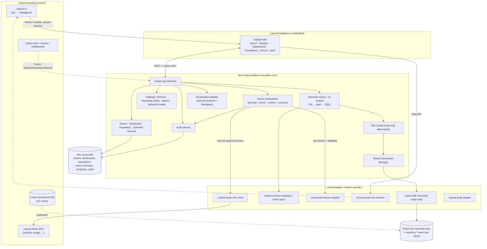

# NAI Analyst — Architecture

Covers required outputs **1 (system architecture)**, **2 (service boundaries)**,
**3 (database connection strategy)**, **8 (AI query flow)**, **9 (SQL validation)**,
and the query-speed strategy.

## 1. System architecture



**Read the diagram in one line:** the embedded UI calls the NAI API with a Lateral
identity; **analytics** flow read-only through the Tenant Connection Manager → Lateral
DB connector → the client's reporting copy; **actions** flow through the Action
Orchestrator → Lateral permission/eligibility checks → Lateral Action APIs; everything
is catalog-governed and audited into the NAI control DB.

**Two databases, clear roles**
- **Client reporting DB (per client, read-only):** the analytics data plane. Holds the
  replicated copy + curated `reporting.*` views. NAI connects with **read-only creds**.
- **NAI control DB (one, multi-tenant, `tenant_id`-scoped):** platform metadata only —
  saved reports, dashboards, populations, metric overrides, schedules, audit events,
  action records. **No client operational data lands here.**

## 2. Service boundaries

Reusable NAI core (never imports anything Lateral-specific):

| Module | Responsibility | Reuses |
|--------|----------------|--------|
| **Connector Service** | Open/query read-only DB connections by dialect | `@etl/connectors` |
| **Tenant Connection Manager** | Resolve the correct client reporting connection from the authenticated tenant; pool; secret resolution | `@etl/secrets`, `@etl/tenancy` |
| **Schema Catalog** | Introspected schema of each reporting DB | `@etl/schema-discovery` |
| **Reporting View Catalog** | Registered `reporting.*` views + documented joins + lineage | new `semantic-model` |
| **Metric Catalog** | Certified metric definitions + tenant overrides + certification status | new `metric-catalog` |
| **Semantic Query Service** | Structured query IR → validated SQL for a dialect | new `sql-compiler` |
| **AI Analyst Service** | NL intent → structured query plan; explanation; follow-ups | `@etl/ai-service` |
| **SQL Guard** | Static + parse validation: SELECT-only, allow-listed views, limits, forbidden constructs | new `sql-guard` |
| **Report / Dashboard / Population / Schedule** | Persist & run saved artefacts; cron | `@etl/database`, reuse ETL scheduler pattern |
| **Permission Adapter** | Interface the core calls to check entitlements (impl provided by edition adapter) | — |
| **Action Orchestrator** | preview → permission → eligibility → confirm → execute → audit state machine | new `action-orchestrator` |
| **Audit Service** | Append-only structured audit events | `@etl/audit` |
| **Visualization Adapter** | Chart/table spec → renderer (internal or Metabase) | new `visualization` |

Edition adapter (Lateral) — implements the core's interfaces:

```text
Lateral Adapter
├── Lateral DB Connector            (read-only conn profile per client)
├── Lateral Schema Mapping          (operational tables → reporting.* views)
├── Lateral Metric Pack             (certified formulas per Lateral definitions)
├── Lateral Permission Adapter      (maps Lateral entitlements → NAI permission checks)
├── Lateral Account Link Resolver   (accountId → Lateral deep-link URL)
├── Lateral Action API Client       (Create Worklist first)
└── Lateral Audit Adapter           (mirror key events back to Lateral if required)
```

The **Permission Adapter** and **Action orchestrator interfaces** are the seam: the
core never hard-codes "Lateral". A `CashmereAdapter` later implements the same
interfaces against Cashmere's schema/permissions/APIs.

## 3. Database connection strategy

**Principle:** per-client isolation, read-only, dynamically resolved from the tenant.

- Each authenticated request carries a **tenant/client id** (from the Lateral identity).
  The **Tenant Connection Manager** maps `tenantId → connection profile` (host, port,
  db, dialect, **read-only** user) whose credentials live only as a **`secretRef`** in
  the secrets manager (never in the control DB, never in the browser).
- **Read-only enforcement in depth:** (a) the DB user is granted `SELECT` only on the
  `reporting` schema; (b) the SQL Guard rejects non-SELECT; (c) `SET default_transaction_read_only = on` / `SET TRANSACTION READ ONLY` per session; (d) a
  short **`statement_timeout`** and **row/result caps**.
- **Pooling & limits:** one bounded pool per client connection (idle reap, max
  connections), per-request `statement_timeout`, server-side **query cancellation**
  on client disconnect/timeout, and a hard **row limit** appended to every plan.
- **Dialect adapters:** the reporting copies may be Postgres or MySQL (Lateral's
  `rdebt_*` runs on MySQL/HediSQL per the migration docs). The SQL compiler targets a
  dialect from the connection profile. *(Blocking question: confirm dialect — see MVP.)*
- **No cross-client queries.** A tenant can only ever reach its own reporting DB; the
  connection is chosen server-side from the verified identity, never from a request param.

## 8. AI query flow

The AI produces a **structured plan first**; the backend compiles it to SQL. The model
never emits raw SQL for the normal experience.

```mermaid
flowchart LR
  A[NL question] --> B[Intent + entity resolution]
  B --> C[Resolve certified metrics]
  C --> D[Resolve dimensions + filters]
  D --> E[Confirm tenant + permission context]
  E --> F[Structured query plan (IR)]
  F --> G[Validate plan against catalog]
  G --> H[Compile to SQL (dialect)]
  H --> I[SQL Guard: limits + safety]
  I --> J[Execute on read-only DB]
  J --> K[Validate result]
  K --> L[Generate explanation + definitions + assumptions]
  L --> M[Render table/chart]
  M --> N[Offer safe next actions]
```

- Steps 1–5 use the **AI Analyst Service** (LLM via `@etl/ai-service`, structured
  output constrained to the plan schema). Steps 6–13 are **deterministic** — no LLM in
  the data path. The structured IR is the contract (see [SEMANTIC-MODEL.md](./SEMANTIC-MODEL.md#structured-query-representation)).
- **Grounding:** the model only sees the **catalog** (metrics, dimensions, filters,
  view descriptions) — never the raw schema — so it can't invent joins. If it can't map
  a request to certified metrics/dimensions, it asks a clarifying question instead of
  guessing.
- **Honesty:** correlation/inference is labelled as such; uncertain conclusions are never
  stated as fact (enforced in the explanation contract).

## 9. SQL validation approach

SQL is only ever produced by the **deterministic compiler** from a validated plan, then
passed through the **SQL Guard** before execution:

- **Allow-list, not deny-list:** only registered `reporting.*` views and their documented
  joins/columns may appear. Anything else → rejected.
- Parse to an AST (dialect-aware). Enforce: **single statement**, **SELECT/WITH only**,
  no DDL/DML/DCL, no stored-procedure/`CALL`, no `INTO`/`COPY`/file functions, no system
  schemas (`pg_*`, `information_schema`, `mysql`, `performance_schema`), no forbidden
  functions (e.g. `pg_read_file`, `lo_*`, `xp_*`).
- **Injected safety:** append `LIMIT`, wrap with a result-size cap, set
  `statement_timeout`, run under a read-only transaction. Sensitive fields are **masked**
  or **omitted** based on the caller's permission set before results leave the API.
- **Restricted SQL mode** for advanced authorized analysts is a *separate* surface with
  the same Guard (allow-listed views only) — never wired into the normal AI experience.

## Query-speed strategy

Targets: simple metric < 2s · grouped report < 5s · complex < 15s · large export → async.

- **Curated + indexed reporting views** and **precomputed daily summaries**
  (`reporting.payment_daily`, `reporting.collector_performance_daily`, …) so common
  metrics read from small aggregates, not raw tables.
- **Result cache** keyed by `(tenant, plan-hash, freshness-watermark)`; **metric cache**
  for hot metrics; cache invalidated on the reporting copy's refresh watermark.
- **Async execution** for large reports/exports (job + status + notification), reusing the
  scheduler/worker pattern already in the ETL platform.
- **Progress + cancellation:** every query is cancellable; the UI shows status and never
  blocks indefinitely.
- **Data-freshness watermark:** the reporting copy exposes a `last_refreshed_at`; the UI
  shows "Data updated N minutes ago" and caching respects it.
