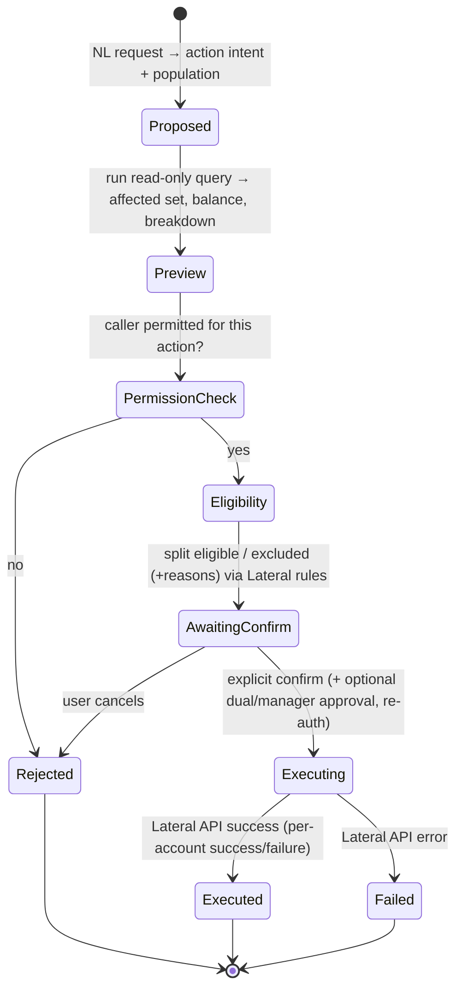

# NAI Analyst — Security, Permissions, Actions & Audit

Covers required outputs **4 (security model)**, **5 (permission matrix)**,
**10 (action orchestration)**, **11 (audit-event design)**.

## 4. Security model

**Identity & auth (shared, no separate login).** The embedded UI never authenticates on
its own. Lateral is the identity provider: it issues a short-lived, signed **context
token** (JWT) carrying `tenant_id`, `client_id(s)`, `user_id`, `roles/entitlements`, and
`exp`. NAI verifies it (JWKS from Lateral) on every request and derives all context from
it — never from request params. *(Blocking question: exact mechanism — JWT vs session
proxy vs iframe postMessage handshake — see MVP.)*

**Trust boundaries.**
- Browser ↔ NAI API: HTTPS + the Lateral context token. The browser gets **no** DB
  credentials, **no** raw SQL, **no** connection details.
- NAI API ↔ reporting DB: **read-only** user, credentials from the secrets manager,
  resolved per tenant at query time.
- NAI API ↔ Lateral Action API: authenticated service/relationship credential; the
  *user's* authority is re-checked by Lateral on execution.

**Data protection.**
- Read-only everywhere for analytics (see [ARCHITECTURE](./ARCHITECTURE.md#3-database-connection-strategy)).
- **Field-level masking / omission** driven by the caller's permissions: a user may see
  the aggregate (count, balance) without any account-level PII/financial rows.
- Credentials only as `secretRef`; encryption in transit and at rest; secrets never
  logged; audit redaction of sensitive values.
- Tenant isolation: control-DB rows carry `tenant_id` (+ RLS); reporting connections are
  physically separate per client.

**Aggregate-vs-record separation (key rule).** Permission to see a *number* is distinct
from permission to see the *records* behind it. The query planner tags each output column
with a sensitivity class; the API strips record-level and sensitive columns when the
caller lacks the matching permission, returning only the aggregate.

```text
1,240 accounts match the criteria.  Total balance $8.3m.
(debtor names / contact details / account rows withheld — you lack "View account-level records")
```

## 5. Permission matrix

Granular permissions, grouped. Enforced at the **API/service layer** (never the UI alone).
The **Lateral Permission Adapter** maps Lateral entitlements → these NAI permissions.

| Group | Permission | Gate |
|-------|-----------|------|
| **Analytics** | `intelligence.view` | Enter Intelligence at all |
| | `ask.aggregate` | Ask questions returning aggregates |
| | `ask.account_level` | Ask questions returning account rows |
| | `view.pii` | See debtor names/contact/PII columns |
| | `view.financial` | See balances/payments/financial columns |
| | `view.account_detail` | Open an account-level record/deep link |
| | `report.create` / `report.share` / `report.certify` | Report lifecycle |
| | `dashboard.create` | Build dashboards |
| | `report.schedule` | Schedule & distribute |
| | `export.aggregate` / `export.account_level` | Export scope |
| | `sql.mode` | Use restricted SQL mode |
| **Populations** | `population.create.static` / `population.create.dynamic` | Save populations |
| | `population.share` / `population.export` / `population.send_to_lateral` | Downstream use |
| **Actions** | `action.create_worklist` (MVP) | Create Worklist |
| | `action.assign` / `action.change_queue` / `action.create_task` / `action.schedule_campaign` / `action.change_workflow` / `action.update_fields` / `action.financial` (future) | Higher-risk actions |
| | `action.approve_batch` | Approve batch actions (dual-approval flows) |

Rules: `ask.account_level` ⟹ implies `ask.aggregate`. `view.pii`/`view.financial` gate
*columns*, independent of `ask.*`. Any `action.*` additionally requires Lateral's own
authorization to pass at execution (defence in depth). Actions are also constrained by
optional **limits** (max accounts, max balance) per role/tenant.

## 10. Action orchestration design

The AI may **prepare** an action; **Lateral executes** it. The orchestrator is a strict
state machine — no step is skippable, and nothing is sent to Lateral before explicit
human confirmation.



**Eligibility is Lateral's call.** NAI shows a preview and may pre-filter with known rules,
but the authoritative eligibility (compliance holds, active arrangements, account locks,
workflow eligibility) is validated by Lateral — either a `validate/dry-run` API or the
execute call returning per-account results. NAI must not fabricate eligibility.

**Every action record captures:** user & tenant identity, action type, selected population
+ criteria, affected/eligible/excluded counts, estimated financial value, permission-check
result, eligibility results + exclusion reasons, the preview, explicit confirmation
(who/when), the Lateral API request ref + response, success/failure counts, failure
reasons, timestamps, and an **Audit ID**.

**Higher-risk actions (future)** support optional: dual approval, manager approval, max
account/balance limits, scheduled execution, re-authentication, dry-run, and rollback
where Lateral supports it. **MVP implements only Create Worklist** on this framework.

## 11. Audit-event design

Append-only, structured, in the NAI control DB. **No AI chain-of-thought is stored** —
only concise, reviewable execution facts.

```jsonc
// audit_event
{
  "id": "aud_…",
  "tenant_id": "…", "client_id": "…", "user_id": "…",
  "ts": "2026-07-14T10:14:03Z",
  "category": "query | report | export | population | action | permission | ai | system",
  "action": "ask.question | report.saved | export.performed | population.created | action.proposed | action.executed | permission.denied | query.failed",
  "subject": { "type": "report|population|action|account_set", "id": "…" },
  "request": { "nl_question": "…", "date_range": "…", "filters": {…} },
  "resolution": {
    "metrics_used": ["net_collections"], "metric_versions": { "net_collections": "v3" },
    "dimensions": ["collector"], "query_plan_ref": "qp_…", "sql_ref": "sql_…",
    "row_count": 2841, "data_freshness": "2026-07-14T10:10:00Z"
  },
  "action_detail": { "type": "create_worklist", "affected": 437, "eligible": 415, "excluded": 22, "value": 2800000, "lateral_ref": "wl_…" },
  "outcome": { "status": "success|failure|denied", "success_count": 415, "failure_count": 0, "reasons": [] },
  "model": { "provider": "anthropic", "model": "…" }   // response id/version, not reasoning
}
```

**Recorded:** questions asked, reports generated/saved/shared, queries executed, filters
used, exports, populations created, actions proposed/approved/executed, accounts affected,
permission failures, query failures, AI model responses (ids/versions), metric versions.

**Admin filtering:** by user, date, report, account, action type, status, tenant, client,
Audit ID. Deep-linkable Audit IDs. Retention & export are tenant-configurable.

**Scheduled-report identity (safety):** scheduled runs execute under a **service identity**
with *explicitly configured* permissions and a pinned metric version — **not** the creating
user's live permissions (which may change or be revoked). Every scheduled run is audited
under that service identity with the originating user recorded as `created_by`.
